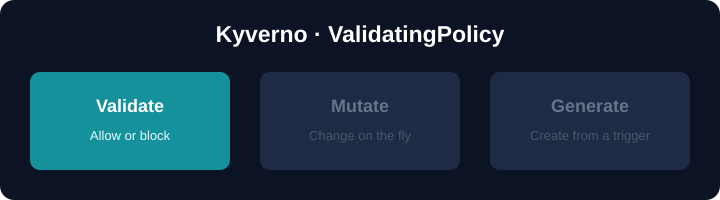

# ValidatingPolicy — allow or block resources

A **ValidatingPolicy** (API group `policies.kyverno.io/v1`) is the modern,
CEL-based way to decide whether a Kubernetes resource is admitted. It replaces
the `validate` rules of the legacy `ClusterPolicy`.

This is a hands-on deep dive, not a quick tour. You will:

| You'll learn | Concept |
|--------------|---------|
| Block vs report vs warn | `validationActions`: `Deny` / `Audit` / `Warn` |
| What a policy matches | `matchConstraints.resourceRules` |
| Writing safe CEL | optional accessors, list membership |
| Dynamic feedback | `variables` + `messageExpression` |
| Where violations show up | PolicyReports |
| Do it yourself | a final **challenge** you solve in the IDE |

## Why CEL, not ClusterPolicy?

The legacy `ClusterPolicy` / `Policy` (`kyverno.io/v1`) are deprecated (v1.19 is
the last release with full support). The CEL types are the future and share the
same expression language as native Kubernetes admission policies.

## Setup

Kyverno **v1.19** is being installed in the background so the stable
`policies.kyverno.io/v1` CRDs are ready. Wait for the short progress indicator
in the terminal to finish, then click **START**.
